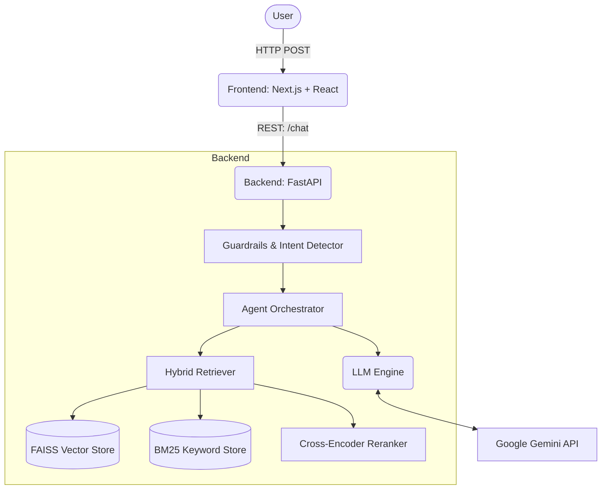

# SHL Assessment Recommender

## 📖 Project Overview
Conversational recommender application designed to help recruiters and hiring managers find matching SHL assessments for their job roles. Built as part of the SHL AI Intern Assignment.

## 🚀 Features
*   **RAG-Powered Chat**: Semantic (FAISS) + keyword (BM25) hybrid search with Reciprocal Rank Fusion and cross-encoder reranking.
*   **Conversational Agent**: Handles clarifications, refinements, assessment suggestions, and comparisons.
*   **Input Guardrails**: Robust defenses against prompt injection, off-topic queries, and gibberish.
*   **Modern Web UI**: Responsive SaaS-grade web client using Next.js, React, TailwindCSS, and shadcn/ui.
*   **State Management**: Pure React state management with `useReducer` and Context (zero external store weight).
*   **Stateless API**: Complies with the stateless conversation constraints (messages history provided each turn).
*   **Evaluation Framework**: Included evaluation runner verifying recall, hallucination rate, and guardrails.

## 🏛️ Architecture Diagram


## 🛠️ Tech Stack
### Backend
*   **Language**: Python 3.12
*   **Framework**: FastAPI + Uvicorn
*   **Embeddings**: `sentence-transformers/bge-small-en-v1.5`
*   **Reranking**: `cross-encoder/ms-marco-MiniLM-L-6-v2`
*   **Vector Database**: FAISS (IndexFlatIP)
*   **Keyword Index**: BM25 (rank-bm25)
*   **LLM Integration**: Google Gemini API (primary) with Groq API (fallback)

### Frontend
*   **Framework**: Next.js 15 (App Router) + React 19 + TypeScript
*   **Styling**: Tailwind CSS v4
*   **Components**: Radix UI + shadcn/ui

## ⚙️ Environment Variables
### Backend (`backend/.env`)
*   `GEMINI_API_KEY`: Your Google Gemini API key.
*   `GROQ_API_KEY`: (Optional) Your Groq API key for fallback.

### Frontend (`frontend/.env.local`)
*   `NEXT_PUBLIC_API_URL`: The URL of your backend API (e.g., `http://localhost:8000`).

## 📥 Installation Steps & How to run locally

### Option A: Running with Docker (Recommended)
From the project root:
```bash
docker compose up --build
```
*   **Frontend**: Available at `http://localhost:3000`
*   **Backend**: Available at `http://localhost:8000`
*   **Swagger API Docs**: Available at `http://localhost:8000/docs`

### Option B: Manual Setup

**1. Run the Backend**:
```bash
cd backend
python -m venv venv
# On Windows
.\venv\Scripts\activate
# On macOS/Linux
source venv/bin/activate

pip install -r requirements.txt
uvicorn app.main:app --reload --port 8000
```

**2. Run the Frontend**:
```bash
cd frontend
npm install
npm run dev
```

## 🌐 Deployment URL
*(Insert your deployment URL here once deployed, e.g., https://shl-recommender.vercel.app)*

## 📡 API Endpoints
The backend provides the following REST API endpoints:
*   `GET /health`: Health check endpoint for deployment readiness probes. Returns `{"status": "ok"}`.
*   `POST /chat`: Processes conversational chat requests. 
    *   **Payload**: `{"messages": [{"role": "user", "content": "..."}]}` (Full conversation history).
    *   **Response**: `{"reply": "...", "recommendations": [...], "end_of_conversation": false}`

## 💡 Assumptions Made
*   **Statelessness**: The backend maintains no memory between requests. The frontend is responsible for tracking and sending the entire conversation history with each turn.
*   **Turn Limit**: A conversation is capped at a maximum of 8 turns. If the criteria are not met by then, the agent gracefully ends the session.
*   **Catalog Data**: The catalog of SHL assessments is assumed to be static during the application lifecycle and is loaded from a local `catalog.json` file.
*   **Language Focus**: The application is primarily designed to handle queries in English, given the embedding models and catalog metadata.
*   **Gibberish Input**: Short inputs containing meaningless characters (e.g., no vowels, random consonants) will be rejected by the guardrail engine to prevent LLM hallucinations.

---

## 📂 Project Structure

```
shl-assessment-recommender/
├── backend/
│   ├── app/                     # FastAPI core config & factory
│   ├── api/                     # Routes, middleware, CORS
│   ├── models/                  # Pydantic schemas & enums
│   ├── prompts/                 # System prompt and RAG context building
│   ├── retrievers/              # Hybrid search, query rewriter, reranker
│   ├── vectorstore/             # FAISS, BM25, and embeddings service
│   ├── scraper/                 # Web scraper and local seed catalog.json
│   ├── evaluation/              # Test cases and quality runner
│   ├── tests/                   # Pytest suite
│   ├── Dockerfile
│   └── requirements.txt
├── frontend/
│   ├── app/                     # App router pages (Landing, Chat)
│   ├── components/              # Chat bubbles, cards, modals, tables
│   ├── hooks/                   # Custom useChat state machine hook
│   ├── lib/                     # API client, constants, utils
│   ├── types/                   # TypeScript interfaces
│   └── Dockerfile
└── docker-compose.yml
```

## 🧪 Testing & Evaluation

### Running Unit Tests
With the backend virtual environment active:
```bash
cd backend
pytest tests/ -v
```

### Running the Evaluation Suite
First, make sure the backend is running at `http://localhost:8000`. Then, execute:
```bash
cd backend
# With venv active
python -m evaluation.eval_runner http://localhost:8000
```
This runs 12 advanced test cases assessing RAG quality, formatting correctness, refusal behavior, refinement capabilities, and prompt injection resistance. Results will be printed to terminal and saved to `backend/evaluation/eval_results.json`.
